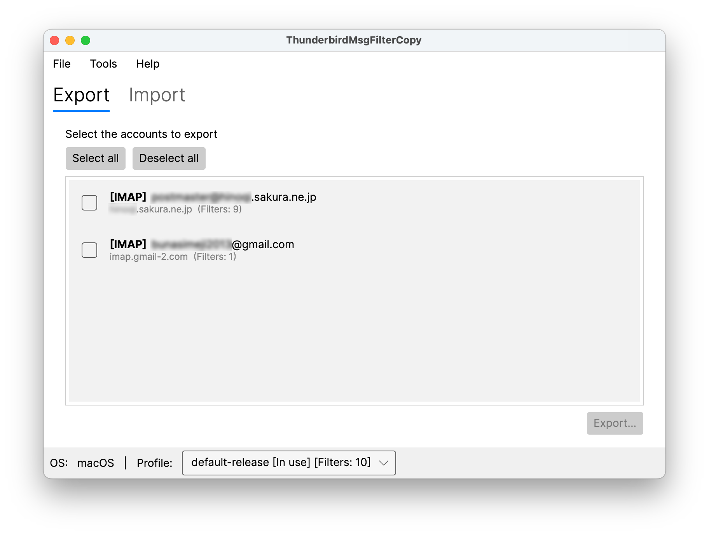
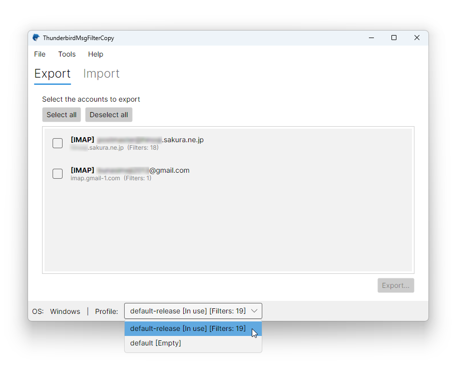
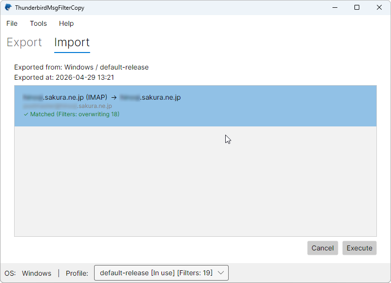

<div align="center">

# ThunderbirdMsgFilterCopy

A desktop tool to safely migrate Thunderbird message filters between machines.

[🇯🇵 日本語版はこちら](README.md)

[](https://dotnet.microsoft.com/)
[](https://avaloniaui.net/)
[]()
[](LICENSE)


</div>

---

## 📋 What is this?

Thunderbird's **message filters** are a powerful feature that automatically sorts, tags, or moves incoming mail. The catch: filter rules are stored per-account in a file called `msgFilterRules.dat`, which makes them painful to migrate when you switch computers or move between operating systems.

**ThunderbirdMsgFilterCopy** solves this by letting you **export** all your filter rules into a single `.tbfilters` file, then **import** them on another machine — preserving years of carefully tuned filter logic in one click.

### Built for these moments

- 🖥️ You just got a new computer and don't want to recreate dozens of filters by hand
- 🔄 You're moving from Windows to macOS (or the other way around)
- 🏢 You want the same filter setup on your work and home machines
- 💾 You'd like a backup of your filter configuration, just in case

---

## 🖼️ Screenshots

<table>
  <tr>
    <td align="center"><b>Windows</b></td>
    <td align="center"><b>macOS</b></td>
  </tr>
  <tr>
    <td></td>
    <td></td>
  </tr>
</table>

Native on both Windows and macOS — Apple Silicon and Intel Macs included.

---

## ✨ Features

- **Per-account selective export** — Pick exactly which accounts to include in your `.tbfilters` file
- **Smart matching** — On import, source and destination accounts are auto-paired by server folder name
- **Undo support** — The most recent import can be reverted with a single menu click
- **Thunderbird-aware** — Operations are locked while Thunderbird is running, preventing data corruption
- **Profile auto-detection** — Multiple Thunderbird profiles are scored and ranked, with the active one selected automatically
- **Drag & drop** — Just drop a `.tbfilters` file onto the window
- **Cross-platform** — Identical experience on Windows and macOS

---

## 💻 Requirements

| | |
|---|---|
| OS | Windows 10 or later / macOS 12 (Monterey) or later |
| Architecture | x64 (Windows) / Apple Silicon & Intel (macOS) |
| Thunderbird | Must be installed at the standard profile location |
| Runtime | None required — self-contained build |

> ⚠️ **Linux is not supported.** Please look elsewhere if you need to migrate filters between Linux Thunderbird installations.

---

## 📦 Download

Grab the latest build from the [**Releases page**](../../releases/latest).

| OS | File |
|---|---|
| Windows | `ThunderbirdMsgFilterCopy-x.y.z-win-x64.zip` |
| macOS (Apple Silicon) | `TbMsgFilterCopy<version>-arm64.dmg` |
| macOS (Intel) | `TbMsgFilterCopy<version>-x64.dmg` |

The macOS build is **notarized by Apple**, so it launches without Gatekeeper warnings.

---

## 🚀 Usage

### 1. Export (on the source machine)



1. Launch the app on your old computer
2. Open the **Export** tab
3. Check the accounts you want to migrate
4. Click **Export…** and save the resulting `.tbfilters` file

### 2. Import (on the destination machine)



1. Launch the app on your new computer
2. Drag the `.tbfilters` file onto the **Import** tab
3. Review the preview screen to see which accounts will be overwritten
4. Click **Run** to apply the changes

> 📝 **How matching works**
> Accounts are paired by server directory name (e.g. `imap.gmail.com`). Accounts that don't match are silently skipped — there's no risk of accidentally overwriting the wrong destination.

### 3. Undo the most recent import

Something went sideways? Open **Tools → Undo Last Import** to roll back to the previous state. The original filter files are automatically backed up before each import, so you can experiment with confidence.

---

## 🛠️ Building from source

### Prerequisites

- [.NET 10 SDK](https://dotnet.microsoft.com/download)
- **Windows**: Visual Studio 2022 / 2025 / 2026, or JetBrains Rider
- **macOS**: JetBrains Rider + Xcode Command Line Tools

### Build steps

```bash
git clone https://github.com/<your-account>/ThunderbirdMsgFilterCopy.git
cd ThunderbirdMsgFilterCopy
dotnet build
dotnet run --project ThunderbirdMsgFilterCopy
```

### Building a macOS release

The `build_and_release.sh` script at the repository root handles the entire macOS release pipeline — building the `.app` bundle, code-signing, notarizing with Apple, and packaging into a DMG. See the script's header comment for configuration details.

```bash
./build_and_release.sh
```

### Forcing a UI language (handy for screenshots)

```bash
# Launch in Japanese
ThunderbirdMsgFilterCopy.exe --lang ja

# Launch in English
ThunderbirdMsgFilterCopy.exe --lang en
```

---

## 🏗️ Tech stack

- **Language**: C# (latest language version)
- **Runtime**: .NET 10
- **UI framework**: [Avalonia UI](https://avaloniaui.net/)
- **Architecture**: MVVM ([CommunityToolkit.Mvvm](https://github.com/CommunityToolkit/dotnet))

---

## 🗺️ Roadmap

Out of scope for v1, but on the radar for future releases:

- [ ] Expanded language support beyond English and Japanese
- [ ] Filter merge mode (current behavior is overwrite-only)
- [ ] Manual account-mapping UI
- [ ] Multi-generation backup history
- [ ] In-app preview of filter contents

---

## 🤝 Contributing

Bug reports and feature requests are welcome via [Issues](../../issues). Pull requests are appreciated too.

---

## 📄 License

Released under the [MIT License](LICENSE).

---

## 👤 Author

**Mitsuhiro Hibara** ([HiBARA Software, LLC](https://hibara.org/))

- Web: [https://hibara.org/](https://hibara.org/)
- GitHub: [@hibara](https://github.com/hibara)

---

<div align="center">
  <sub>Hoping to make Thunderbird filter migration just a little less painful.</sub>
</div>


