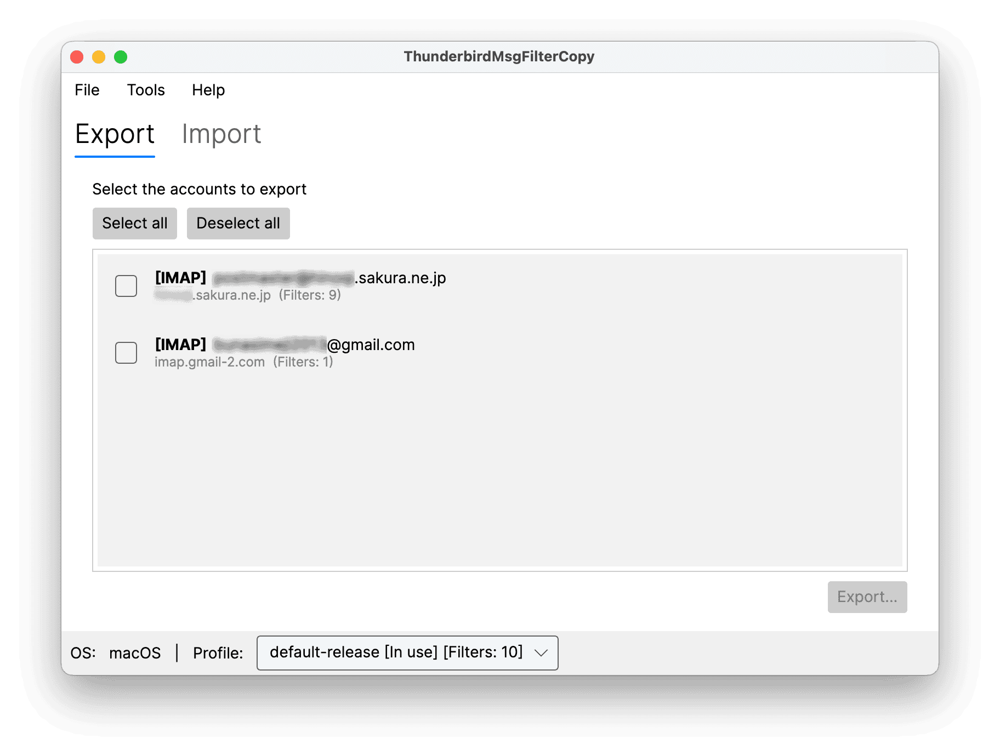
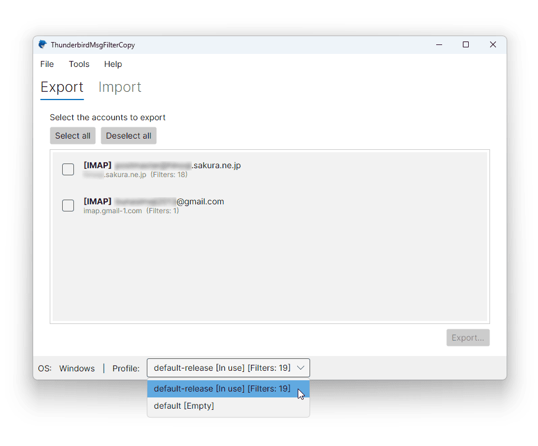
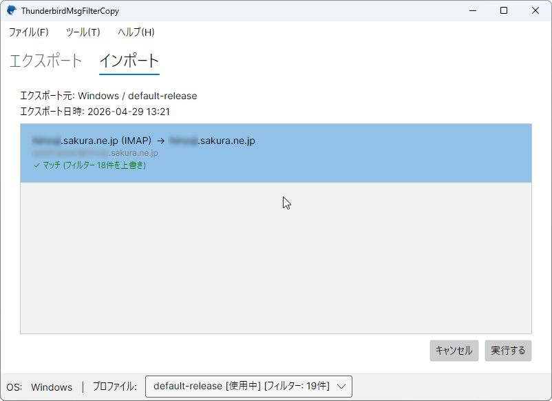

<div align="center">

# ThunderbirdMsgFilterCopy

Thunderbird のメッセージフィルターを別マシンへ安全に移植するデスクトップツール

[🇬🇧 English version is here](README.en.md)

[](https://dotnet.microsoft.com/)[](https://avaloniaui.net/)
[]()
[](LICENSE)


</div>

---

## 📋 これは何?

Thunderbird には「メッセージフィルター」という、受信メールを自動で振り分けたりタグ付けしたりする強力な機能があります。しかしその設定は **`msgFilterRules.dat` というファイルにアカウント単位で保存されている**ため、新しい PC に乗り換えるときや、Windows と Mac の間で環境を揃えたいときに、手作業で再設定するのが非常に面倒です。

**ThunderbirdMsgFilterCopy** は、このフィルター設定を `.tbfilters` という単一ファイルに**エクスポート**し、別マシンに**インポート**することで、フィルターをまるごと移植できるツールです。

### こんな場面で役立ちます

- 🖥️ 新しい PC に買い替えたので、何十個も作ったフィルターを移植したい
- 🔄 Windows から macOS（または逆方向）へ環境を移したい
- 🏢 会社の PC と自宅の PC で同じフィルター設定を共有したい
- 💾 大事なフィルター設定をバックアップしておきたい

---

## 🖼️ スクリーンショット

<table>
  <tr>
    <td align="center"><b>Windows</b></td>
    <td align="center"><b>macOS</b></td>
  </tr>
  <tr>
    <td></td>
    <td></td>
  </tr>
</table>

Windows / macOS のどちらでもネイティブに動作します（Apple Silicon / Intel 両対応）。

---

## ✨ 主な機能

- **アカウント単位の選択エクスポート** — 必要なアカウントだけを選んで `.tbfilters` ファイルに書き出し
- **賢いマッチング** — インポート時に移行元と移行先のアカウントを自動で対応付け
- **取り消し機能** — 直前のインポートはワンクリックで元に戻せる安心設計
- **Thunderbird 起動検知** — Thunderbird が動いている間は操作をロックして事故を防止
- **プロファイル自動検出** — 複数プロファイルがあってもスコアリングで「使用中」を自動判別
- **ドラッグ&ドロップ対応** — `.tbfilters` ファイルをウィンドウに放り込むだけ
- **クロスプラットフォーム** — Windows と macOS で同じ操作感

---

## 💻 動作環境

| 項目 | 要件 |
|---|---|
| OS | Windows 10 以降 / macOS 12 (Monterey) 以降 |
| アーキテクチャ | x64 (Windows) / Apple Silicon・Intel (macOS) |
| Thunderbird | 既定のプロファイル位置にインストール済みであること |
| 追加ランタイム | 不要（自己完結型ビルド） |

> ⚠️ **Linux は対応外**です。Linux 版 Thunderbird のフィルター移植には別ツールをご利用ください。

---

## 📦 ダウンロード

最新版は [**Releases ページ**](../../releases/latest) からダウンロードできます。

| OS | ファイル |
|---|---|
| Windows | `ThunderbirdMsgFilterCopy-x.y.z-win-x64.zip` |
| macOS (Apple Silicon) | `TbMsgFilterCopy<version>-arm64.dmg` |
| macOS (Intel) | `TbMsgFilterCopy<version>-x64.dmg` |

macOS 版は**公証 (Notarization) 済み**なので、Gatekeeper の警告なしにそのまま起動できます。

---

## 🚀 使い方

### 1. エクスポート(移行元の PC で)



1. 移行元 PC で本ツールを起動
2. **Export** タブを開く
3. エクスポートしたいアカウントにチェックを入れる
4. **エクスポート…** ボタンを押して `.tbfilters` ファイルを保存

### 2. インポート(移行先の PC で)



1. 移行先 PC で本ツールを起動
2. **Import** タブに `.tbfilters` ファイルをドラッグ&ドロップ
3. プレビュー画面で、どのアカウントが上書きされるか確認
4. **実行する** ボタンで反映

> 📝 **マッチングのルール**
> 同じサーバーディレクトリ名（例: `imap.gmail.com`)を持つアカウントが自動で対応付けられます。マッチしないアカウントはスキップされるので、誤上書きの心配はありません。

### 3. 直前のインポートを取り消す

うまくいかなかったときは、メニューの **ツール → 直前のインポートを取り消す** から元の状態に戻せます。インポート前のフィルターファイルが自動的にバックアップされているため、安全に試行錯誤できます。

---

## 🛠️ ビルド方法(開発者向け)

### 前提

- [.NET 10 SDK](https://dotnet.microsoft.com/download)
- Windows: Visual Studio 2022/2025/2026 または JetBrains Rider
- macOS: JetBrains Rider + Xcode Command Line Tools

### ビルド手順

```bash
git clone https://github.com/<your-account>/ThunderbirdMsgFilterCopy.git
cd ThunderbirdMsgFilterCopy
dotnet build
dotnet run --project ThunderbirdMsgFilterCopy
```

---

## 🏗️ 技術スタック

- **言語**: C# (最新言語バージョン)
- **ランタイム**: .NET 10
- **UI フレームワーク**: [Avalonia UI](https://avaloniaui.net/)
- **アーキテクチャ**: MVVM ([CommunityToolkit.Mvvm](https://github.com/CommunityToolkit/dotnet))

---

## 🗺️ ロードマップ

v1 では実装していないが、今後検討する機能:

- [ ] 英語以外の多言語対応の拡充
- [ ] フィルターのマージモード（現在は上書きのみ)
- [ ] 手動アカウントマッピング UI
- [ ] バックアップの世代管理
- [ ] フィルター内容のプレビュー表示

---

## 🤝 貢献

バグ報告や機能要望は [Issues](../../issues) まで。Pull Request も歓迎します。

---

## 📄 ライセンス

[MIT License](LICENSE) の下で公開しています。

---

## 👤 作者

**Mitsuhiro Hibara** ([HiBARA Software, LLC](https://hibara.jp/))

- Web: [https://hibara.jp/](https://hibara.jp/)
- GitHub: [@hibara](https://github.com/hibara)

---

<div align="center">
  <sub>Thunderbird のフィルター移植が、ちょっと幸せになりますように。</sub>
</div>
